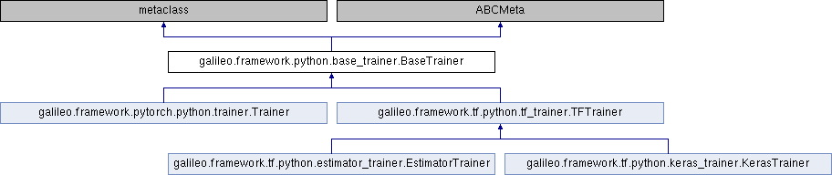

# Galileo APIs

目录
====
   * [galileo.BaseTrainer](#galileobasetrainer)
   * [galileo.BaseInputs](#galileobaseinputs)
   * [galileo.[tf|pytorch].Supervised](#galileotfpytorchsupervised)
   * [galileo.[tf|pytorch].Unsupervised](#galileotfpytorchunsupervised)
   * [galileo.BaseMessagePassing](#galileobasemessagepassing)
      * [Convolutions](#convolutions)
         * [galileo.[tf|pytorch].SAGELayer](#galileotfpytorchsagelayer)
         * [galileo.[tf|pytorch].SAGESparseLayer](#galileotfpytorchsagesparselayer)
   * [galileo.BaseTransform](#galileobasetransform)
   * [Transforms接口](#transforms接口)
      * [galileo.[tf|pytorch].RandomWalkNegTransform](#galileotfpytorchrandomwalknegtransform)
      * [galileo.[tf|pytorch].EdgeNegTransform](#galileotfpytorchedgenegtransform)
      * [galileo.[tf|pytorch].NeighborNegTransform](#galileotfpytorchneighbornegtransform)
      * [galileo.[tf|pytorch].MultiHopNeighborTransform](#galileotfpytorchmultihopneighbortransform)
      * [galileo.[tf|pytorch].MultiHopFeatureTransform](#galileotfpytorchmultihopfeaturetransform)
      * [galileo.[tf|pytorch].MultiHopFeatureLabelTransform](#galileotfpytorchmultihopfeaturelabeltransform)
      * [galileo.[tf|pytorch].MultiHopFeatureNegTransform](#galileotfpytorchmultihopfeaturenegtransform)
      * [galileo.[tf|pytorch].BipartiteTransform](#galileotfpytorchbipartitetransform)
      * [galileo.[tf|pytorch].RelationTransform](#galileotfpytorchrelationtransform)
      * [galileo.[tf|pytorch].MultiHopFeatureLabelSparseTransform](#galileotfpytorchmultihopfeaturelabelsparsetransform)
      * [galileo.[tf|pytorch].MultiHopFeatureNegSparseTransform](#galileotfpytorchmultihopfeaturenegsparsetransform)
      * [galileo.[tf|pytorch].MultiHopFeatureSparseTransform](#galileotfpytorchmultihopfeaturesparsetransform)
   * [Dataset接口](#dataset接口)
      * [galileo.[tf|pytorch].dataset_pipeline](#galileotfpytorchdataset_pipeline)
      * [galileo.[tf|pytorch].VertexDataset](#galileotfpytorchvertexdataset)
      * [galileo.[tf|pytorch].EdgeDataset](#galileotfpytorchedgedataset)
      * [galileo.[tf|pytorch].TextLineDataset](#galileotfpytorchtextlinedataset)
      * [galileo.[tf|pytorch].RangeDataset](#galileotfpytorchrangedataset)
      * [galileo.[tf|pytorch].TensorDataset](#galileotfpytorchtensordataset)
   * [aggregator聚合层](#aggregator聚合层)
      * [galileo.[tf|pytorch].MeanAggregator](#galileotfpytorchmeanaggregator)
      * [galileo.[tf|pytorch].MeanPoolAggregator](#galileotfpytorchmeanpoolaggregator)
      * [galileo.[tf|pytorch].MaxPoolAggregator](#galileotfpytorchmaxpoolaggregator)
      * [galileo.[tf|pytorch].GCNAggregator](#galileotfpytorchgcnaggregator)
      * [galileo.[tf|pytorch].get_aggregator](#galileotfpytorchget_aggregator)
   * [layers接口](#layers接口)
      * [galileo.[tf|pytorch].DenseFeatureEncoder](#galileotfpytorchdensefeatureencoder)
      * [galileo.[tf|pytorch].SparseFeatureEncoder](#galileotfpytorchsparsefeatureencoder)
      * [galileo.[tf|pytorch].FeatureCombiner](#galileotfpytorchfeaturecombiner)
      * [galileo.[tf|pytorch].Embedding](#galileotfpytorchembedding)
      * [galileo.[tf|pytorch].Dense](#galileotfpytorchdense)
   * [tools接口](#tools接口)
      * [galileo.convert](#galileoconvert)
      * [galileo.get_data_source](#galileoget_data_source)
      * [galileo.get_evaluate_vertex_ids](#galileoget_evaluate_vertex_ids)
      * [galileo.get_test_vertex_ids](#galileoget_test_vertex_ids)
      * [galileo.save_embedding](#galileosave_embedding)
      * [galileo.get_fanouts_list](#galileoget_fanouts_list)
      * [galileo.get_fanouts_dim](#galileoget_fanouts_dim)
      * [galileo.define_service_args](#galileodefine_service_args)
      * [galileo.create_client](#galileocreate_client)
      * [galileo.start_service](#galileostart_service)
      * [galileo.start_service_from_args](#galileostart_service_from_args)
   * [图引擎服务的采样接口](#图引擎服务的采样接口)
      * [galileo.[tf|pytorch].ops.sample_vertices](#galileotfpytorchopssample_vertices)
      * [galileo.[tf|pytorch].ops.sample_edges](#galileotfpytorchopssample_edges)
      * [galileo.[tf|pytorch].ops.sample_neighbor](#galileotfpytorchopssample_neighbor)
      * [galileo.[tf|pytorch].ops.get_topk_neighbors](#galileotfpytorchopsget_topk_neighbors)
      * [galileo.[tf|pytorch].ops.get_full_neighbors](#galileotfpytorchopsget_full_neighbors)
      * [galileo.[tf|pytorch].ops.get_pod_feature](#galileotfpytorchopsget_pod_feature)
      * [galileo.[tf|pytorch].ops.sample_seq_by_multi_hop](#galileotfpytorchopssample_seq_by_multi_hop)
      * [galileo.[tf|pytorch].ops.sample_seq_by_random_walk](#galileotfpytorchopssample_seq_by_random_walk)
      * [galileo.[tf|pytorch].ops.sample_pairs_by_random_walk](#galileotfpytorchopssample_pairs_by_random_walk)

## galileo.BaseTrainer
所有trainer的基类，Galileo实现了三种trainer，分别是galileo.tf.KerasTrainer, galileo.tf.EstimatorTrainer和galileo.pytorch.Trainer。用户直接使用三个子类即可，也可以自定义实现自己的训练器。

子类必须实现方法: get_dataset, get_optimizer, train, evaluate, predict

[galileo.BaseTrainer](api/galileo_framework_python_base_trainer_BaseTrainer.3.md)

[galileo.pytorch.Trainer](api/galileo_framework_pytorch_python_trainer_Trainer.3.md)

[galileo.tf.KerasTrainer](api/galileo_framework_tf_python_keras_trainer_KerasTrainer.3.md)

[galileo.tf.EstimatorTrainer](api/galileo_framework_tf_python_estimator_trainer_EstimatorTrainer.3.md)

## galileo.BaseInputs
用户定义的模型的数据输入类需要继承的基类。

子类必须实现方法: train_data, evaluate_data, predict_data

[galileo.BaseInputs](api/galileo_framework_python_base_inputs_BaseInputs.3.md)

## galileo.[tf|pytorch].Supervised

Supervised类继承自[BaseSupervised类](api/galileo_framework_python_base_supervised_BaseSupervised.3.md)，提供了图有监督模型的基本框架。

[galileo.tf.Supervised](api/galileo_framework_tf_python_supervised_Supervised.3.md)

[galileo.pytorch.Supervised](api/galileo_framework_pytorch_python_supervised_Supervised.3.md)

## galileo.[tf|pytorch].Unsupervised

Unsupervised类继承自[BaseUnsupervised类](api/galileo_framework_python_base_unsupervised_BaseUnsupervised.3.md)，提供了图无监督模型的基本框架。

[galileo.tf.Unsupervised](api/galileo_framework_tf_python_unsupervised_Unsupervised.3.md)

[galileo.pytorch.Unsupervised](api/galileo_framework_pytorch_python_unsupervised_Unsupervised.3.md)

## galileo.BaseMessagePassing
所有GNN的卷积层的基类，提供了Message Passing范式的基本流程

子类应该覆盖的方法: message,aggregate,update，可选方法message_and_aggregate

目前Galileo实现了针对graphSAGE的galileo.[tf|pytorch].SAGELayer以及SAGESparseLayer，更多的卷积层更新中

[galileo.BaseMessagePassing](api/galileo_framework_python_base_message_passing_BaseMessagePassing.3.md)

### Convolutions

#### galileo.[tf|pytorch].SAGELayer

[galileo.pytorch.SAGELayer](api/galileo_framework_pytorch_python_convolutions_sage_layer_SAGELayer.3.md)

[galileo.tf.SAGELayer](api/galileo_framework_tf_python_convolutions_sage_layer_SAGELayer.3.md)

#### galileo.[tf|pytorch].SAGESparseLayer

[galileo.pytorch.SAGESparseLayer](api/galileo_framework_pytorch_python_convolutions_sage_layer_sparse_SAGESparseLayer.3.md)

[galileo.tf.SAGESparseLayer](api/galileo_framework_tf_python_convolutions_sage_layer_sparse_SAGESparseLayer.3.md)

## galileo.BaseTransform

用户定义的模型的数据输入类需要使用的Transform的基类，galileo提供了常用的Transforms。用户也可以自定义。

子类需要覆盖的方法：transform

[galileo.BaseTransform](api/galileo_framework_python_base_transform_BaseTransform.3.md)

## Transforms接口
### galileo.[tf|pytorch].RandomWalkNegTransform
随意游走+负采样

[galileo.pytorch.RandomWalkNegTransform](api/galileo_framework_pytorch_python_transforms_rw_neg_RandomWalkNegTransform.3.md)

[galileo.tf.RandomWalkNegTransform](api/galileo_framework_tf_python_transforms_rw_neg_RandomWalkNegTransform.3.md)

### galileo.[tf|pytorch].EdgeNegTransform
边采样+负采样

[galileo.pytorch.EdgeNegTransform](api/galileo_framework_pytorch_python_transforms_edge_neg_EdgeNegTransform.3.md)

[galileo.tf.EdgeNegTransform](api/galileo_framework_tf_python_transforms_edge_neg_EdgeNegTransform.3.md)

### galileo.[tf|pytorch].NeighborNegTransform
邻居采样+负采样

[galileo.pytorch.NeighborNegTransform](api/galileo_framework_pytorch_python_transforms_neighbor_neg_NeighborNegTransform.3.md)

[galileo.tf.NeighborNegTransform](api/galileo_framework_tf_python_transforms_neighbor_neg_NeighborNegTransform.3.md)

### galileo.[tf|pytorch].MultiHopNeighborTransform
多跳邻居采样

[galileo.pytorch.MultiHopNeighborTransform](api/galileo_framework_pytorch_python_transforms_multi_hop_MultiHopNeighborTransform.3.md)

[galileo.tf.MultiHopNeighborTransform](api/galileo_framework_tf_python_transforms_multi_hop_MultiHopNeighborTransform.3.md)

### galileo.[tf|pytorch].MultiHopFeatureTransform
多跳邻居采样+特征

[galileo.pytorch.MultiHopFeatureTransform](api/galileo_framework_pytorch_python_transforms_multi_hop_feature_MultiHopFeatureTransform.3.md)

[galileo.tf.MultiHopFeatureTransform](api/galileo_framework_tf_python_transforms_multi_hop_feature_MultiHopFeatureTransform.3.md)

### galileo.[tf|pytorch].MultiHopFeatureLabelTransform
多跳邻居采样+特征+标签

[galileo.pytorch.MultiHopFeatureLabelTransform](api/galileo_framework_pytorch_python_transforms_multi_hop_feature_label_MultiHopFeatureLabelTransform.3.md)

[galileo.tf.MultiHopFeatureLabelTransform](api/galileo_framework_tf_python_transforms_multi_hop_feature_label_MultiHopFeatureLabelTransform.3.md)

### galileo.[tf|pytorch].MultiHopFeatureNegTransform
多跳邻居采样+特征+负采样

[galileo.pytorch.MultiHopFeatureNegTransform](api/galileo_framework_pytorch_python_transforms_multi_hop_feature_neg_MultiHopFeatureNegTransform.3.md)

[galileo.tf.MultiHopFeatureNegTransform](api/galileo_framework_tf_python_transforms_multi_hop_feature_neg_MultiHopFeatureNegTransform.3.md)

### galileo.[tf|pytorch].BipartiteTransform
用于Message Passing过程中生成二部图结构

[galileo.pytorch.BipartiteTransform](api/galileo_framework_pytorch_python_transforms_bipartite_BipartiteTransform.3.md)

[galileo.tf.BipartiteTransform](api/galileo_framework_tf_python_transforms_bipartite_BipartiteTransform.3.md)

### galileo.[tf|pytorch].RelationTransform
用于Message Passing过程中生成关系图结构

[galileo.pytorch.RelationTransform](api/galileo_framework_pytorch_python_transforms_relation_RelationTransform.3.md)

[galileo.tf.RelationTransform](api/galileo_framework_tf_python_transforms_relation_RelationTransform.3.md)

### galileo.[tf|pytorch].MultiHopFeatureLabelSparseTransform
多跳邻居采样+特征+标签, sparse 版本

[galileo.pytorch.MultiHopFeatureLabelSparseTransform](api/galileo_framework_pytorch_python_transforms_multi_hop_feature_label_sparse_MultiHopFeatureLabelSparseTransform.3.md)

[galileo.tf.MultiHopFeatureLabelSparseTransform](api/galileo_framework_tf_python_transforms_multi_hop_feature_label_sparse_MultiHopFeatureLabelSparseTransform.3.md)

### galileo.[tf|pytorch].MultiHopFeatureNegSparseTransform
多跳邻居采样+特征+负采样, sparse 版本

[galileo.pytorch.MultiHopFeatureNegSparseTransform](api/galileo_framework_pytorch_python_transforms_multi_hop_feature_neg_sparse_MultiHopFeatureNegSparseTransform.3.md)

[galileo.tf.MultiHopFeatureNegSparseTransform](api/galileo_framework_tf_python_transforms_multi_hop_feature_neg_sparse_MultiHopFeatureNegSparseTransform.3.md)

### galileo.[tf|pytorch].MultiHopFeatureSparseTransform
多跳邻居采样+特征, sparse 版本

[galileo.pytorch.MultiHopFeatureSparseTransform](api/galileo_framework_pytorch_python_transforms_multi_hop_feature_sparse_MultiHopFeatureSparseTransform.3.md)

[galileo.tf.MultiHopFeatureSparseTransform](api/galileo_framework_tf_python_transforms_multi_hop_feature_sparse_MultiHopFeatureSparseTransform.3.md)

## Dataset接口

我们通过Dataset机制拉取图数据，提高数据读取效率。

### galileo.[tf|pytorch].dataset_pipeline
输入基础dataset和transform得到最终的dataset。会根据当前配置得到分布式的dataset。

[galileo.pytorch.dataset_pipeline](../galileo/framework/pytorch/python/dataset/dataset_pipeline.py)

[galileo.tf.dataset_pipeline](../galileo/framework/tf/python/dataset/dataset_pipeline.py)

### galileo.[tf|pytorch].VertexDataset
基础dataset，从图引擎服务中采样点
### galileo.[tf|pytorch].EdgeDataset
基础dataset，从图引擎服务中采样边
### galileo.[tf|pytorch].TextLineDataset
基础dataset，从外部文件读取csv格式的图数据
### galileo.[tf|pytorch].RangeDataset
基础dataset，创建range dataset
### galileo.[tf|pytorch].TensorDataset
基础dataset，从tensor创建dataset

## aggregator聚合层
### galileo.[tf|pytorch].MeanAggregator
mean aggregator 实现可以参考代码和graphsage论文

[galileo.pytorch.MeanAggregator](../galileo/framework/pytorch/python/layers/aggregators.py)

[galileo.tf.MeanAggregator](../galileo/framework/tf/python/layers/aggregators.py)

### galileo.[tf|pytorch].MeanPoolAggregator
meanpool aggregator 实现可以参考代码和graphsage论文
### galileo.[tf|pytorch].MaxPoolAggregator
maxpool aggregator 实现可以参考代码和graphsage论文
### galileo.[tf|pytorch].GCNAggregator
gcn aggregator 实现可以参考代码和graphsage论文
### galileo.[tf|pytorch].get_aggregator
通过名称获取aggregator, 可选mean, meanpool, maxpool, gcn

## layers接口
### galileo.[tf|pytorch].DenseFeatureEncoder
稠密特征的encoder

[galileo.pytorch.DenseFeatureEncoder](../galileo/framework/pytorch/python/layers/feature_encoder.py)

[galileo.tf.DenseFeatureEncoder](../galileo/framework/tf/python/layers/feature_encoder.py)

### galileo.[tf|pytorch].SparseFeatureEncoder
稀疏特征的encoder
### galileo.[tf|pytorch].FeatureCombiner
稠密特征和稀疏特征的合并接口
### galileo.[tf|pytorch].Embedding
Embedding类
### galileo.[tf|pytorch].Dense
dense类

## tools接口
### galileo.convert
转换图数据工具接口

[galileo.convert](../galileo/framework/python/convert.py)

### galileo.get_data_source
转换公开图数据集
### galileo.get_evaluate_vertex_ids
公开图数据集的evaluate集
### galileo.get_test_vertex_ids
公开图数据集的test集
### galileo.save_embedding
保存顶点的embedding为numpy文件，顶点和embedding会分别保存
### galileo.get_fanouts_list
计算fanouts_list
### galileo.get_fanouts_dim
计算fanouts_dim
### galileo.define_service_args
定义图服务的args，主要定义data_source_name，data_path，zk_server，role等，更多可参考galileo_service -h
### galileo.create_client
创建图服务的client，一般用户不会直接创建，trainer会创建。
### galileo.start_service
启动图服务
### galileo.start_service_from_args
使用args启动图服务，结合define_service_args使用。

[galileo.start_service_from_args](../galileo/framework/python/service.py)

## 图引擎服务的采样接口
### galileo.[tf|pytorch].ops.sample_vertices
**sample_vertices(types, count)**
* 功能：根据指定类型和数量采样顶点
* 参数：
* types：list[uint8_t]，指定采样的顶点类型；
    * count：int，指定每种点类型需要采样的数目
* 返回值：list[Tensor]。
    * 成功时len(list)=1，list[0]int64_t类型的Tensor，存储顶点ID，shape为(len(types),count)。
    * 失败时抛异常(tf)或len(list)=0(torch)

### galileo.[tf|pytorch].ops.sample_edges
**sample_edges(types, count)**
* 功能：根据指定类型和数量采样边
* 参数：
    * types：list[uint8_t]，指定采样的边类型；
    * count：int，指定每种边类型需要采样的数目
* 返回值：list[Tensor]。
    * 成功时len(list)=3，其中
        * list[0]为int64_t类型的Tensor，存储源节点ID；
        * list[1]为int64_t类型的Tensor，存储目的节点ID；
        * list[2]为uint8_t类型的Tensor，存储边类型。
        * Tensor的shape都为(len(types),count)。
    * 失败时抛异常(tf)或len(list)=0(torch)

### galileo.[tf|pytorch].ops.sample_neighbor
**sample_neighbor(vertices, edge_types, count, has_weight)**
* 功能：采样指定顶点和边类型的邻居
* 参数：
    * vertices：list[int64_t]，采样邻居的顶点ID；
    * edge_types：list[uint8_t]，采样邻居的边类型；
    * count：int，每个顶点采样的邻居数目；
    * has_weight：bool，是否返回邻居权重
* 返回值：list[Tensor]。
    * 成功时
        * 如果has_weight=true，len(list)=2，其中list[0]为int64_t类型的Tensor，存储邻居ID；list[1]为float类型的Tensor，存储邻居权重；
        * 如果has_weight=false，len(list)=1，返回结果中不包含存储邻居权重信息的float类型的Tensor。
        * 该接口成功返回的Tensor shape都为(len(vertices), count)。
    * 失败时抛异常(tf)或len(list)=0(torch)

### galileo.[tf|pytorch].ops.get_topk_neighbors
**get_topk_neighbors(vertices, edge_types, k, has_weight)**
* 功能：查询指定顶点和边类型中，权重最高的前k个邻居
* 参数：
    * vertices：list[int64_t]，查询topk邻居的顶点ID；
    * edge_types：list[uint8_t]，查询topk邻居的边类型；
    * k：int，每个顶点查询的top邻居数目；
    * has_weight：bool，是否返回邻居的权重
* 返回值：list[Tensor]。
    * 成功时
        * 如果has_weight=true，len(list)=2，其中list[0]为int64_t类型的Tensor，存储邻居ID；list[1]为float类型的Tensor，存储邻居权重。
        * 如果has_weight=false，len(list)=1，返回结果中不包含存储邻居权重信息的float类型的Tensor。
        * 该接口成功返回的Tensor shape都为(len(vertices), k)。
    * 失败时抛异常(tf)或len(list)=0(torch)

### galileo.[tf|pytorch].ops.get_full_neighbors
**get_full_neighbors(vertices, edge_types, has_weight)**
* 功能：查询指定顶点和边类型的所有邻居
* 参数：
    * vertices：list[int64_t]，查询邻居的顶点ID；
    * edge_types：list[uint8_t]，查询邻居的边类型；
    * has_weight：bool，是否返回邻居的权重信息
* 返回值：list[Tensor]。
    * 成功时
        * 如果has_weight=true，len(list)=3，其中list[0]为int64_t类型的Tensor，按照verticves顺序存储每个点的所有邻居ID；list[1]为float类型的Tensor，按照verticves顺序存储每个点的所有邻居权重；list[2]为int32_t类型的Tensor，存储每个顶点的邻居在list[0]中的起始下标索引和数目。
        * 如果has_weight=false，len(list)=2，返回结果中不包含存储邻居权重信息的float类型的Tensor。
        * 该接口返回的Tensor中，存储邻居ID和权重的Tensor对应shape为（total_neighbors,），存储邻居索引信息的Tensor对应shape为(len(vertices), 2)。
    * 失败时抛异常(tf)或len(list)=0(torch)

### galileo.[tf|pytorch].ops.get_pod_feature
**get_pod_feature(ids, fnames, dims, ftypes)**
* 功能：查询指定顶点对应pod类型属性的值，不支持string等非Pod类型的属性查询
* 参数：
    * ids：`list[int] or list[src:list[int],dst:list[int],types:list[int]]` 查询属性的顶点或边；
    * fnames：list[string]，查询的属性名；
    * dims：设置返回的每个属性值的最大维度，len(dims)=len(fnames)；
    * ftypes：list[type]，指定每个属性的类型，len(ftypes)=len(fnames)
* 返回值：list[Tensor]
    * 成功时，len(list)=len(fnames)，Tensor的类型为ftypes指定的类型，shape为(len(vertices),dim)。
    * 失败时抛异常(tf)或len(list)=0(torch)

### galileo.[tf|pytorch].ops.sample_seq_by_multi_hop
**sample_seq_by_multi_hop(vertices, metapath, counts, has_weight)**
* 功能：采样包含起始点的多跳邻居序列
* 参数：
    * vertices：list[int]，采样多跳序列的起始点ID；
    * metapath：list[list[int]]，指定每一步采样邻居的边类型；
    * counts：list[int] 指定每步采样的邻居数目；
    * has_weight：bool，是否返回邻居的权重信息
* 返回值：list[Tensor]
    * 成功时
        * 如果has_weight=true，len(list)=2，Tensor的shape是(len(vertices),total_neighbors)。其中
            * list[0]为int64_t类型的Tensor，存储每个顶点的多跳邻居序列，第一列是起始点vertices；
            * list[1]为float类型的Tensor，存储每个顶点的多跳邻居权重序列，第一列是1.0。
        * 如果has_weight=false，len(list)=1，返回结果中不包含存储邻居权重信息的float类型的Tensor。
    * 失败时，例如某个顶点没有邻居
        * 抛异常(tf)或len(list)=0(torch)

### galileo.[tf|pytorch].ops.sample_seq_by_random_walk
**sample_seq_by_random_walk(vertices, metapath, repetition, p=1.0, q=1.0)**
* 功能：采样包含起始点的带偏重的随机游走邻居序列
* 参数：
    * vertices：list[int64_t]，随机游走的起始点ID；
    * metapath：list[list[uint8_t]]，指定每一步随机游走的边类型；
    * repetition：指定每个起始点采样的次数；
    * p：return parm，控制访问已遍历节点的概率；
    * q：In-out param，控制BFS和DFS策略概率，q>1倾向BFS，q<1倾向DFS
* 返回值：
    * Tensor，类型为int64_t，shape为(len(vertices)\*repetition,len(metapath))，存储包含起始点的随机游走序列。
    * 失败时抛异常(tf)或None(torch)

### galileo.[tf|pytorch].ops.sample_pairs_by_random_walk
**sample_pairs_by_random_walk(vertices, metapath, repetition, context_size, p=1.0, q=1.0)**
* 功能：使用带偏重的随机游走算法采样包含起始点的邻居序列，并根据contex_size返回顶点对
* 参数：
    * vertices：list[int64_t]，随机游走的起始点ID；
    * metapath：list[list[uint8_t]]，指定每一步随机游走的边类型；
    * repetition：指定每个起始点采样的次数；
    * contex_size:生成节点对的滑动窗口大小；
    * p：return parm，控制访问已遍历节点的概率；
    * q：In-out param，控制BFS和DFS策略概率，q>1倾向BFS，q<1倾向DFS
* 返回值
    * Tensor，类型为int64_t，shape为(pair_num,2)，存储随机游走序列生成的顶点对。
    * 失败时抛异常(tf)或None(torch)
