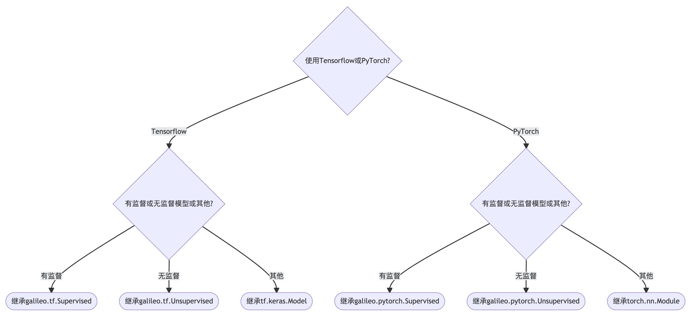

# Galileo定制化图模型

Galileo定制化图模型分两部分，自定义模型输入和自定义模型。

## 自定义模型输入

使用Galileo提供的Transforms构建模型输入见[入门教程中的构建模型输入](introduce.md)。更多的Transforms见[API](api.md)中Transforms接口。

这里介绍如何自定义模型输入。有两种方法。

1. 继承`galileo.BaseTransform`实现其中的`transform`方法。

2. 直接在Inputs类中实现`transform`方法，更加方便一些。

参考[GCN的例子](../examples/tf/gcn/gcn.py)，使用了方法2实现了获取目标顶点的标签的`transform`。

`transform`中的需要使用图引擎服务的接口来获取或采样数据，详细接口列表见[API](api.md)中图引擎服务的采样接口。

```python
class Inputs(g.BaseInputs):
    def __init__(self, **kwargs):
        super().__init__(config=kwargs)

    def transform(self, vertices):
        label_name = self.config['label_name']
        label_dim = self.config['label_dim']
        vertices = tf.cast(vertices, tf.int64)
        vertices = tf.reshape(vertices, [-1])
        u_vertices, _ = tf.unique(vertices)
        # 使用 get_pod_feature 获取顶点的标签特征
        labels = gt.ops.get_pod_feature([u_vertices], [label_name],
                                        [label_dim], [tf.float32])[0]
        return dict(targets=u_vertices, labels=labels)

    def train_data(self):
        vertex_type = self.config['vertex_type']

        def base_dataset(**kwargs):
            return gt.VertexDataset(vertex_type, 100)

        return gt.dataset_pipeline(base_dataset, self.transform, **self.config)
```

# 自定义模型

自定义模型可以按照下图选择基类：



Supervised类继承自[BaseSupervised类](api/galileo_framework_python_base_supervised_BaseSupervised.3.md)，提供了图有监督模型的基本框架。

[galileo.tf.Supervised](api/galileo_framework_tf_python_supervised_Supervised.3.md)

[galileo.pytorch.Supervised](api/galileo_framework_pytorch_python_supervised_Supervised.3.md)

Unsupervised类继承自[BaseUnsupervised类](api/galileo_framework_python_base_unsupervised_BaseUnsupervised.3.md)，提供了图无监督模型的基本框架。

[galileo.tf.Unsupervised](api/galileo_framework_tf_python_unsupervised_Unsupervised.3.md)

[galileo.pytorch.Unsupervised](api/galileo_framework_pytorch_python_unsupervised_Unsupervised.3.md)

自定义模型的子类只需要实现其中的encoder方法即可。基类会计算loss和metrics。

如果是继承自tf.keras.Model或torch.nn.Module那么需要实现计算loss和metrics，模型返回一个dict，key包括loss和metrics的名字。

说明：Tensorflow后端的相关类同时支持keras和estimator。

例如：

1. 在tf的[有监督graphSAGE示例](../examples/tf/sage/supervised.py)中继承了galileo.tf.Supervised实现了encoder方法。
2. 在tf的[无监督graphSAGE示例](../examples/tf/sage/unsupervised.py)中继承了galileo.tf.Unsupervised实现了target_encoder方法和context_encoder方法。
3. 在tf的[GCN示例](../examples/tf/gcn/gcn.py)中继承了tf.keras.Model，在call方法是返回一个dict。

更多的定制化图模型例子见[图模型](../examples/README.md)。

